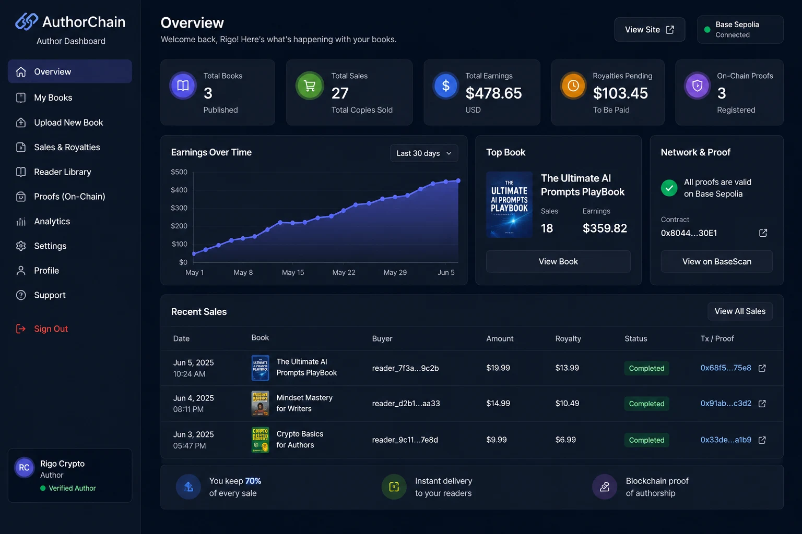
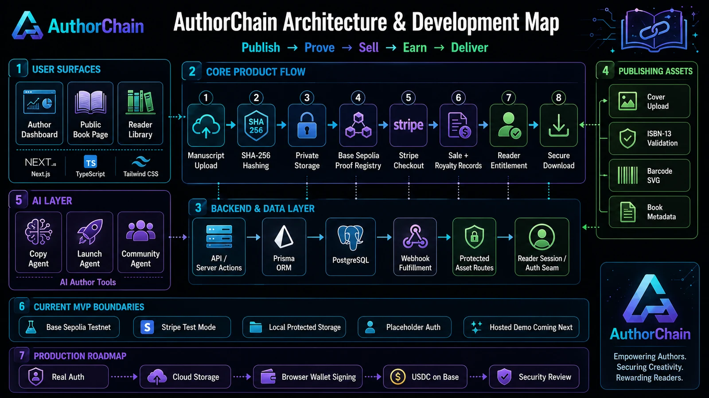

# AuthorChain

**Publish. Own. Earn. Grow.**

AI-powered Web3 publishing infrastructure for independent authors.

Validated MVP loop: **Publish → Prove → Sell → Earn → Deliver**

[](https://rigocrypto.github.io/AuthorChain/)
[](https://sepolia.basescan.org/tx/0x68f58137aa9164d4a98be765695f61921900af9557b3f52339833581954975e8)

[](SECURITY.md)

> Positioning: not an Amazon replacement — a **creator-first** platform giving
> authors AI tools, instant payments, transparent royalties, and digital ownership.

## Dashboard Preview



*Author dashboard (UI preview with sample data).*

## Project Links

- **Project site:** <https://rigocrypto.github.io/AuthorChain/>
- **GitHub repo:** <https://github.com/rigocrypto/AuthorChain>
- **Demo brief:** [./DEMO.md](DEMO.md)
- **Investor memo:** [./docs/INVESTOR_MEMO.md](docs/INVESTOR_MEMO.md)
- **Proof-of-authorship article:** [./docs/ARTICLE_PROOF_OF_AUTHORSHIP.md](docs/ARTICLE_PROOF_OF_AUTHORSHIP.md)
- **Security notes:** [./SECURITY.md](SECURITY.md)
- **Base Sepolia contract:** <https://sepolia.basescan.org/address/0x804447c70af049dA4999AdDd4E344b19a17330E1>
- **Verified proof transaction:** <https://sepolia.basescan.org/tx/0x68f58137aa9164d4a98be765695f61921900af9557b3f52339833581954975e8>
- **Hosted interactive demo:** coming next. The current demo is validated locally
  and documented in [DEMO.md](DEMO.md).

## What Works Today

- Author dashboard
- Book upload
- Private manuscript storage
- Real SHA-256 manuscript hashing
- Base Sepolia proof-of-authorship registry
- Cover upload
- ISBN-13 validation
- EAN-13 barcode SVG generation
- Stripe checkout
- Webhook-based sale and royalty tracking
- Reader entitlement creation
- Protected reader library
- Secure manuscript download for buyers
- 403 access blocking for non-buyers
- SEO-ready GitHub Pages project site

## Verified On-Chain Proof

AuthorChain does **not** store the manuscript on-chain. It stores a **SHA-256 hash
of the actual private manuscript file**. The on-chain `bookHash` matches the
uploaded manuscript's hash **byte for byte** — independently verifiable by anyone.

| | |
| --- | --- |
| **Contract** | `0x804447c70af049dA4999AdDd4E344b19a17330E1` |
| **Book** | The Ultimate AI Prompts PlayBook |
| **Manuscript SHA-256** | `d84e60d24e33ae791998552e57a429772d8d2524e19dfd95bbafbeb14bdcdbc1` |
| **Verified transaction** | [`0x68f58137…954975e8`](https://sepolia.basescan.org/tx/0x68f58137aa9164d4a98be765695f61921900af9557b3f52339833581954975e8) |

## Architecture & Development Map



```text
Author Dashboard
  → Manuscript Upload
  → SHA-256 Hashing
  → Private Storage
  → Base Sepolia Registry
  → Stripe Checkout
  → Webhook Fulfillment
  → Sale + Royalty Records
  → Reader Entitlement
  → Protected Reader Library
  → Secure Download
```

**Tech stack:** Next.js · TypeScript · Tailwind CSS · PostgreSQL · Prisma ·
Stripe · Solidity · Hardhat · Viem · Base Sepolia · local protected storage
(future S3 / R2 / IPFS / Arweave) · GitHub Pages static project site.

## Current MVP Boundaries

- Base Sepolia **testnet**, not mainnet
- Stripe **test mode**
- **Local** protected storage
- **Placeholder** author/reader auth seams
- **Server-side signer** for proof registration
- **Hosted interactive app deployment not live yet**

Each boundary sits behind a clean upgrade seam (storage driver, auth module,
payments/registry clients), so productionizing is additive — not a rewrite.

## Production Roadmap

- Production authentication
- Hosted app deployment
- Cloud storage with S3 / R2 / IPFS / Arweave
- Browser-wallet author signing
- USDC payments on Base
- Refund / revoke automation
- Marketplace discovery
- Security review

## Run Locally

```bash
npm install                  # also runs `prisma generate` (postinstall)
cp .env.example .env         # Prisma + Next both read .env

npm run db:up                # start PostgreSQL (Docker) — host port 5433
npm run db:migrate           # create schema + tables
npm run db:seed              # seed the demo author (Rigo Vivas) + books/sales
npm run dev                  # http://localhost:3000
```

> Requires Docker Desktop. AuthorChain's local Postgres runs on **host port 5433**
> (see [docker-compose.yml](docker-compose.yml)) to avoid clashing with other local
> Postgres containers — `DATABASE_URL` uses `localhost:5433`. Stop the DB with
> `npm run db:down` (data persists in a named volume; `docker compose down -v` wipes it).

## Documentation

- [DEMO.md](DEMO.md) — technical proof + demo flow
- [docs/INVESTOR_MEMO.md](docs/INVESTOR_MEMO.md) — investor/collaborator positioning
- [docs/LINKEDIN_POST.md](docs/LINKEDIN_POST.md) — launch post drafts
- [docs/ARTICLE_PROOF_OF_AUTHORSHIP.md](docs/ARTICLE_PROOF_OF_AUTHORSHIP.md) — the proof-of-authorship explainer
- [SECURITY.md](SECURITY.md) — dependency/security posture

---

## Deep dives

### Database

PostgreSQL via **Prisma** ([prisma/schema.prisma](prisma/schema.prisma)). Models
include `Author`, `Book`, `BookFile`, `BookAsset`, `Sale`, `Royalty`, `Reader`,
`ReaderLibrary`, `AgentOutput`, and `BlockchainRegistration`.

| Script | What it does |
| --- | --- |
| `npm run db:up` / `db:down` | start / stop the Postgres container |
| `npm run db:migrate` | create & apply a migration (dev) |
| `npm run db:reset` | drop, re-migrate, and re-seed |
| `npm run db:seed` | load the demo author + books/sales |
| `npm run db:studio` | open Prisma Studio |

The UI reads through a thin data-access layer ([src/lib/data/](src/lib/data/))
that returns plain DTOs, so it never depends on Prisma directly.

### Authentication (Privy / account abstraction)

Auth uses **Privy** — email/social login plus per-user **embedded smart-account
wallets** (the account-abstraction foundation for author proof-signing and future
USDC, with no MetaMask friction). The server verifies Privy's auth-token cookie in
[src/lib/auth/privy.ts](src/lib/auth/privy.ts); the author/reader session layers
([session.ts](src/lib/auth/session.ts), [reader-session.ts](src/lib/auth/reader-session.ts))
link a Privy identity to an existing `Author`/`Reader` **by verified email** on
first login (so the seeded demo author works when you log in with its email).

- **Dashboard** (`/dashboard/*`) requires an authenticated author; server actions
  call `getCurrentAuthor()` which throws when unauthenticated.
- **Reader** (`/reader/*`) requires a signed-in user; the protected download
  (`/api/reader/books/[id]/download`) additionally requires an **ACTIVE**
  entitlement (else `403`).
- **Setup:** create a Privy app, set `NEXT_PUBLIC_PRIVY_APP_ID` + `PRIVY_APP_SECRET`
  (see [.env.example](.env.example)). Buyers sign in with the **same email they
  purchased with** to access their library. Without Privy configured, auth
  features are unavailable but the app still builds and public pages still load.

### Payments (Stripe)

Card checkout uses **Stripe Checkout**: public book page → `startCheckoutAction` →
Stripe hosted checkout → `checkout.session.completed` webhook → `Sale` + `Royalty`
created (idempotent). Prices are always read server-side from the database — never
trusted from the client. If `STRIPE_SECRET_KEY` is unset, the buy button shows a
"payments unavailable" state and the webhook returns `503` instead of crashing.

**Local testing:** add test keys to `.env`, run `npm run dev`, forward webhooks
with `stripe listen --forward-to localhost:3000/api/webhooks/stripe` (copy the
printed `whsec_...` into `STRIPE_WEBHOOK_SECRET`), then buy a published book with
the Stripe test card `4242 4242 4242 4242` (any future expiry / CVC / ZIP).

### Proof of authorship (blockchain)

Authors register a book on **Base Sepolia** as tamper-evident proof of authorship +
timestamp. The contract is
[`contracts/AuthorChainRegistry.sol`](contracts/AuthorChainRegistry.sol).

- **Stored on-chain:** a `bookHash`, the author's wallet, a `metadataHash`, a
  royalty rate (bps), and a timestamp.
- **Never on-chain:** book text, manuscripts, private file URLs, or buyer data.

The `bookHash` **prefers the real uploaded manuscript's SHA-256**, falling back to
stable identity fields only when no file is uploaded
([`src/lib/blockchain/book-hash.ts`](src/lib/blockchain/book-hash.ts)). MVP signing
uses a **server signer** (`DEPLOYER_PRIVATE_KEY`, testnet only); a later phase can
switch to author-signed (browser wallet) transactions. If registry env vars are
missing, the dashboard shows a clear "not configured" state and never crashes.

| Script | What it does |
| --- | --- |
| `npm run hh:compile` | compile the Solidity contract |
| `npm run hh:test` | run the contract test suite (in-process EVM) |
| `npm run hh:deploy` | deploy to Base Sepolia (needs RPC + deployer key) |

**Deploy:** fund a **testnet** wallet, set `BASE_SEPOLIA_RPC_URL` +
`DEPLOYER_PRIVATE_KEY` (testnet key only) in `.env`, run `npm run hh:deploy`, then
copy the printed address into `NEXT_PUBLIC_REGISTRY_ADDRESS` and restart the app.

### Manuscript storage & file hashing

On upload the server computes a **SHA-256** of the file bytes
([`src/lib/storage/hash.ts`](src/lib/storage/hash.ts)), stores the bytes via the
active storage driver (locally under **`.storage/books/`**, gitignored, never in
`public/`), records a `BookFile`, and sets `Book.fileHash`. The blockchain proof
then uses that real file hash, so a registered book proves a *specific file*
existed at registration time — not just a database row. Once a book is registered,
manuscript replacement is disabled (a new file would invalidate the proof).

The `StorageDriver` interface is provider-agnostic (`STORAGE_DRIVER` env), so
S3 / Cloudflare R2 / IPFS / Arweave can be added as drop-in drivers later.

### Cover, ISBN & barcode (publishing identity)

Covers (JPG/PNG/WEBP) and ISBN barcodes are **public** publishing assets, stored
under `.storage/` and served only through a controlled route — never by exposing a
storage key:

```text
GET /api/assets/books/[bookId]/cover     # public cover image
GET /api/assets/books/[bookId]/barcode   # ISBN barcode SVG
```

AuthorChain **does not issue ISBNs** — authors enter their own, and we validate the
ISBN-13 ([`src/lib/publishing/isbn.ts`](src/lib/publishing/isbn.ts)). An ISBN-13 is
an EAN-13, so the barcode is rendered as **SVG** via `bwip-js`
([`src/lib/publishing/barcode.ts`](src/lib/publishing/barcode.ts)) and stored as a
`BookAsset`. Cover/ISBN metadata are publishing assets and **do not** change the
registered manuscript proof hash.

### Reader library & protected access

When a reader buys a book, the Stripe webhook — in the same transaction that
records the `Sale` + `Royalty` — upserts a `Reader` by email and creates an
`ACTIVE` `ReaderLibrary` entitlement linked to the sale (idempotent on retry). The
checkout success page links to `GET /api/reader/claim?session_id=…`, which resolves
the buyer server-side and sets a **signed, httpOnly cookie**
([`src/lib/auth/reader-session.ts`](src/lib/auth/reader-session.ts)).

The manuscript is delivered **only** through a gated route:

```text
GET /api/reader/books/[bookId]/download
```

It requires a signed-in reader with an **ACTIVE** entitlement — otherwise `403`.
The storage key is never exposed, and the manuscript is **never** reachable through
the public `/api/assets/...` route.

| Asset | Visibility | Route |
| --- | --- | --- |
| Cover, barcode | Public | `/api/assets/books/[id]/cover` · `/barcode` |
| Manuscript | Private (ACTIVE entitlement only) | `/api/reader/books/[id]/download` |

### Project structure

```text
src/
  app/
    (marketing)/         # public site (own header/footer)
      book/[slug]/       # public book sales page
    dashboard/           # author app (upload / books / agents / sales)
    reader/              # reader library + protected book pages
    api/                 # webhooks/stripe, assets, reader routes
  components/            # ui, dashboard chrome, cards
  lib/
    auth/                # Privy session bridge (author + reader)
    data/                # data-access layer → DTOs
    storage/             # StorageDriver + local driver + sha-256 hashing
    publishing/          # ISBN validation + barcode (bwip-js)
    payments/            # stripe + usdc boundaries
    blockchain/          # registry client (viem) + book-hash util
prisma/                  # schema.prisma + seed.ts
contracts/               # AuthorChainRegistry.sol (proof of authorship)
test/                    # Hardhat contract tests
scripts/deploy.ts        # Base Sepolia deploy script
docs/                    # GitHub Pages site + memo/article/post
docker-compose.yml       # local PostgreSQL (host port 5433)
```
